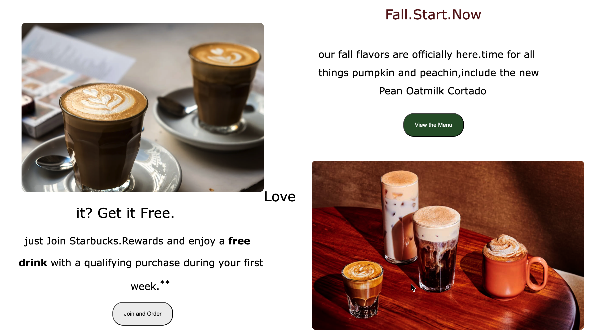

<p align="center">
  
</p>

<p align="center">
  
</p>

---

<p align="center">
  
  
  
  
</p>

---

# ☕ Starbucks Clone — Elite Frontend Build

> ⚡ A **high-end Starbucks landing page clone** engineered to demonstrate modern frontend skills, layout mastery, and production-style design thinking.

This is not just another clone — it is a **portfolio-grade project** built to reflect how professional interfaces are structured and styled.

---

# 🌐 Live Experience

## 👉 https://starbucks-clone-weld.vercel.app/

_(Replace if your link is different)_

---

# 🖼️ Preview

## 🏠 Hero Section

<p align="center">
  
</p>

---

## 🍂 Seasonal Showcase

<p align="center">
  
</p>

---

## 🍰 Menu Pairings

<p align="center">
  
</p>

---

# 🔥 What Makes This Project Exceptional

Most clones focus only on copying visuals.

This project focuses on **engineering the layout like a real product.**

✅ Pixel-conscious spacing  
✅ Professional typography scale  
✅ Visual rhythm & alignment  
✅ Real-world landing page structure  
✅ Clean CSS architecture  
✅ Component-style thinking  
✅ Strong UI polish

---

# 🧠 Skills Demonstrated

### 🎨 Frontend Engineering

- Semantic HTML5
- Advanced CSS3
- Flexbox
- CSS Grid
- Layout Systems

### 🎯 Design Intelligence

- Visual hierarchy
- Color balance
- Spacing discipline
- UX awareness

---

# 🛠️ Tech Stack

| Technology | Purpose          |
| ---------- | ---------------- |
| **HTML5**  | Structure        |
| **CSS3**   | Styling & Layout |
| **Vercel** | Deployment       |

---

# 📂 Architecture

```
starbucks-clone
│
├── index.html
├── style.css
└── images
     ├── preview-1.png
     ├── preview-2.png
     └── preview-3.png
```

---

# 🚀 Run Locally

```bash
git clone https://github.com/Akash-Wakade-7008-alt/starbucks-clone.git
cd starbucks-clone
```

Open **index.html** in your browser.

---

# 📈 Developer Growth From This Project

✔ Learned how production landing pages are structured  
✔ Improved UI judgment  
✔ Practiced scalable CSS  
✔ Strengthened layout engineering  
✔ Built portfolio-level confidence

---

# 🔮 Future Upgrades (Already Planned)

⭐ Full responsiveness  
⭐ JavaScript-powered interactions  
⭐ Micro-animations  
⭐ React conversion  
⭐ Performance optimization  
⭐ Dark mode

---

# 👨‍💻 Developer

## **Akash Wakade**

🚀 Aspiring Software Engineer | Frontend Developer | Future GSoC Contributor

<p align="left">
  <a href="https://github.com/Akash-Wakade-7008-alt">
    
  </a>
  
  <a href="https://www.linkedin.com/in/akash-wakade-08b8412b2">
    
  </a>
</p>


---

# ⭐ If This Project Impressed You...

<p align="center">
Give it a ⭐ on GitHub — it helps more than you think!
</p>

